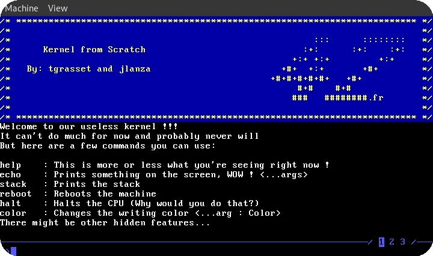
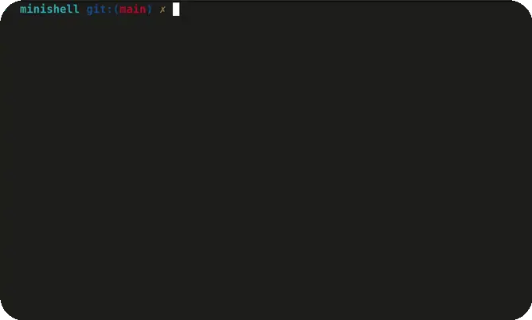
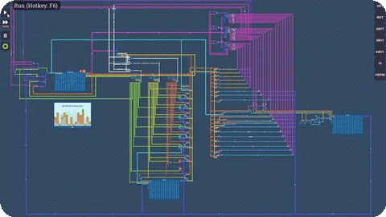
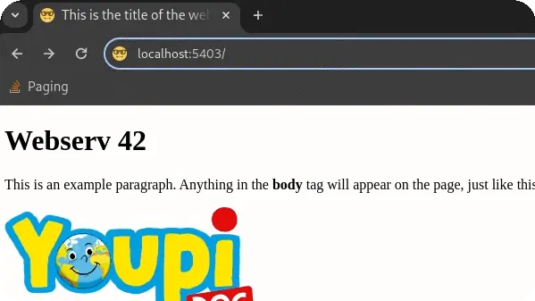
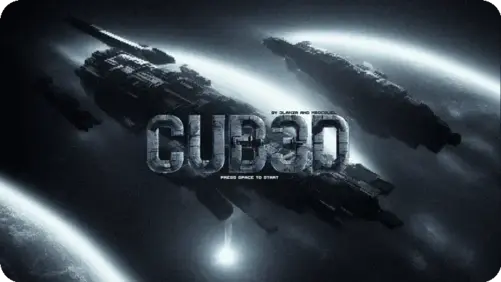
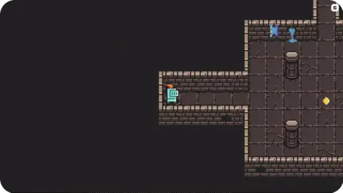

# Hi, I'm Joseph Lanza
I started my journey at the [42 school](https://github.com/42Paris) (Paris) the 06/11/2022. I finished the Common Core the 06/12/2023. I am currently working to get a RNCP level 7 certification (information system and networks).

## My 42 Cursus Progress 

# Projects
## Low Level
|[Kernel From Scratch](https://github.com/lanzaj/kfs)|[Minishell](https://github.com/lanzaj/minishell)|
|---|---|
|||
| An OS (kernel) in `Rust` and `asm`| A shell in coded in `C` |

|[Nand2Computer](https://github.com/lanzaj/Nand2Computer)|[Webserv](https://github.com/lanzaj/webserv)|
|---|---|
|||
| My own 8bit computer and `asm`| A web server in `C++` |

## Video Games

|[Cub3D](https://github.com/lanzaj/cub3d) | [So_long](https://github.com/lanzaj/so_long) |
|---|---|
|||
|A *Wolfensteing3D-like* in `C` without any game engine | A *2D* video game coded in `C` without any game engine|

## Data Structures & Algorithms
|[Push_Swap](https://github.com/lanzaj/push_swap)|
|---|
||
|Sorting a stack using another stack in `C`|

## Web
|[Pong_office](https://github.com/rertzer/ft_transcendence)|
|---|
||
|A Pong online hidden in a LibreOffice page in `React`|

## DevOps
|[Inception of Things](https://github.com/lanzaj/Inception-of-Things)|
|---|
|An introduction to kubernetes and continuous integration.|

## 💻 Tech Stack:

### Language

    

### Tools

    

